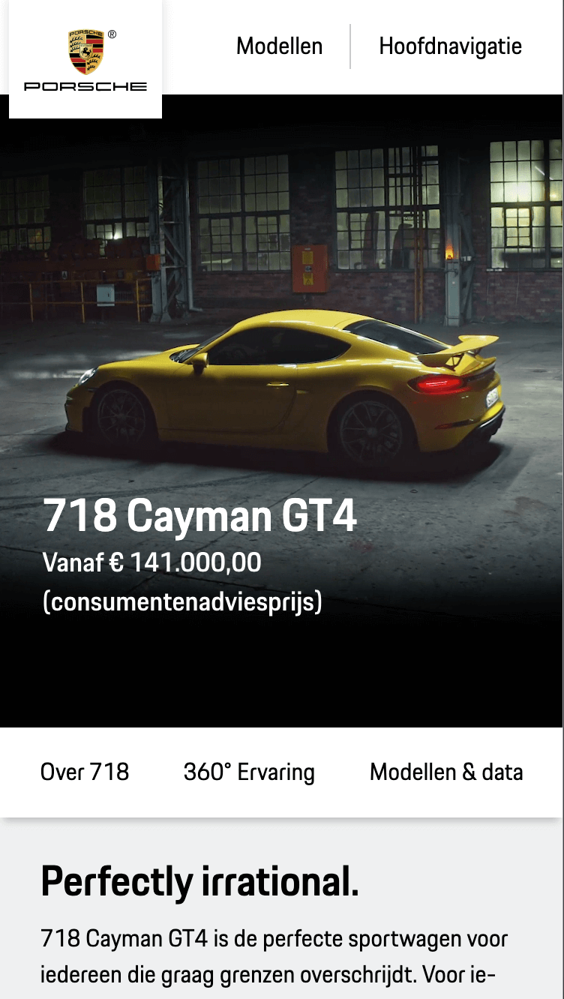
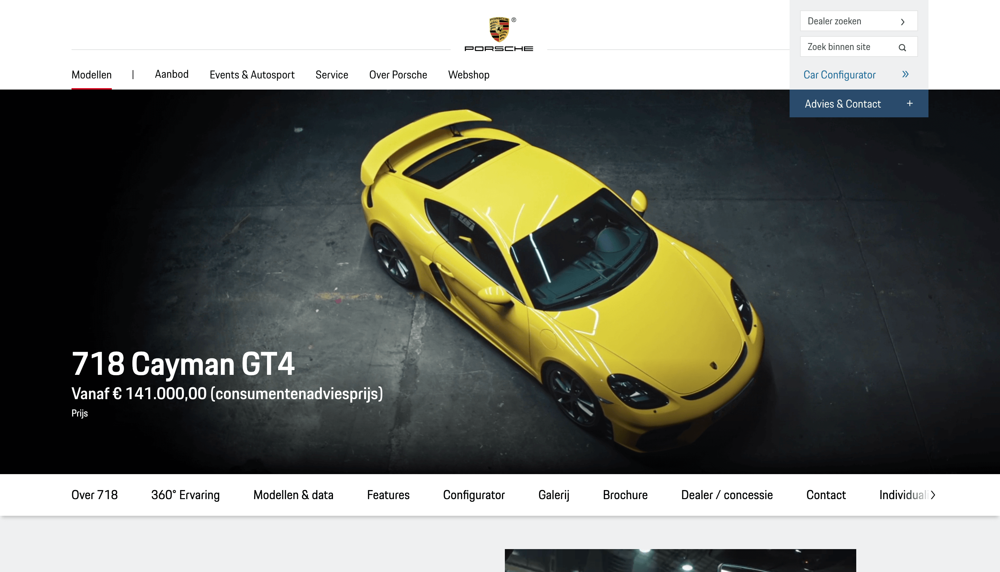

# Procesverslag
**Auteur:** Mark van Heusden

Markdown cheat cheet: [Hulp bij het schrijven van Markdown](https://github.com/adam-p/markdown-here/wiki/Markdown-Cheatsheet). Nb. de standaardstructuur en de spartaanse opmaak zijn helemaal prima. Het gaat om de inhoud van je procesverslag. Besteedt de tijd voor pracht en praal aan je website.

## Bronnenlijst
1. -bron 1-
2. -bron 2-
3. -...-

## Eindgesprek (week 7/8)

-dit ging goed & dit was lastig-

**Screenshot(s):**

-screenshot(s) van je eindresultaat-

## Voortgang 3 (week 6)

-same as voortgang 1-

## Voortgang 2 (week 5)

-same as voortgang 1-

## Voortgang 1 (week 3)

### Stand van zaken

- Veel ging goed. Het kost veel tijd meer nog niet tegen veel dingen aangelopen. Alleen slider maken was wel lastig. Ook afbeeldingen afsnijden gaat niet altijd even soepel.
- Ik kijk wel op tegen de detailpagina, omdat deze heel veel werk is

### Agenda voor meeting

| student 1: Anniek             | student 2: Gwyneth        | student 3: Chantal              | student 4: Mark   |
| ---                           | ---                       | ---                             | ---               |
| De slider in de header.       | De afbeeldingen in de slider 2 op de gamepagina. | Hoe ik het optijd ga afkrijgen. | Hoe kan ik icoontjes toevoegen voor en na tekst, '>' en bolletjes voor sliders.     |
| De breedte van afbeeldingen.  | Zoekbalk zonder streepje. |                                 | Moet elk drop-down ding/slide worden uitgewerkt.  |
| De footer die 2-koloms hoort. |                           |                                 | Social gedeelte heel lelijk op de echte site, moet dit ook zo uitgewerkt worden.               |

### Verslag van meeting

- Niet te moeilijk denken, gewoon '>' teken op toetsenbord gebruiken.
- Nee, niet elk menu. Ook 2 menu's bovenaan hoeven niet.
- Lelijke hoeft niet uitgewerkt te worden. Zelf op goeie manier oplossen.

## Breakdownschets (week 1)

## Intake (week 1)

**Je startniveau:** rood

**Je focus:** responsive

**Je opdracht:** https://www.porsche.com/netherlands/nl/

**Screenshot(s) van de eerste pagina (small screen):**

**Screenshot(s) van de tweede pagina (small screen):**

