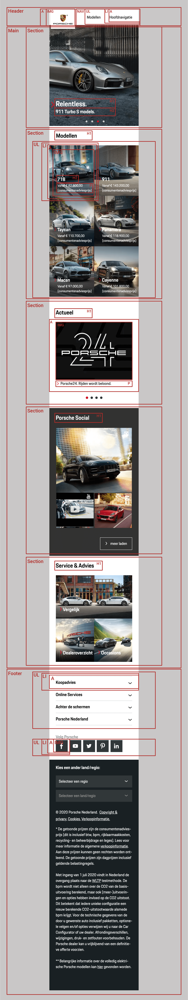
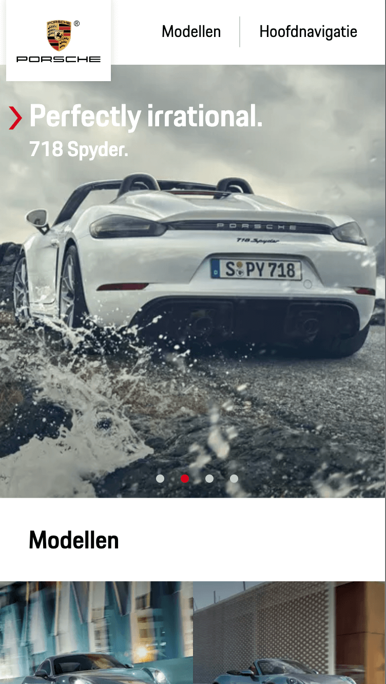
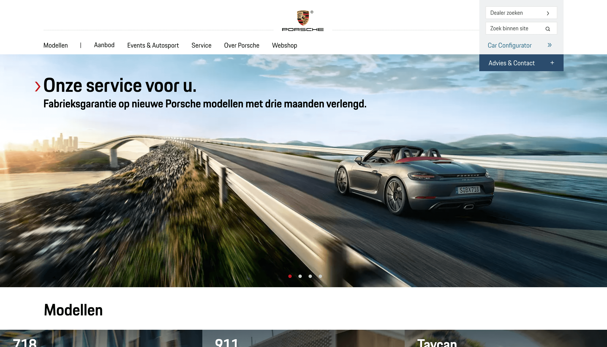

# Procesverslag
**Auteur:** Mark van Heusden

## Bronnenlijst
1. Afbeeldingen/content: www.Porsche.com

## Eindgesprek (week 7/8)

-dit ging goed & dit was lastig-

**Screenshot(s):**

-screenshot(s) van je eindresultaat-

## Voortgang 3 (week 6)

- Deze week was een drukke week. Ik heb niet zoveel tijd aan FeD besteed als ik wou, maar ik heb wel nog een aantal dingen gedaan om de detailpagina verder af te krijgen. Ook heb ik veel tijd besteed aan de slider. Ik de bolletjes aan de onderkant geprobeerd werkend te krijgen. Dit is deels gelukt, alleen nog niet zoals ik wil. Ik ga hier later verder naar kijken als ik tijd over heb.

## Voortgang 2 (week 5)

### Stand van zaken

- Over het algemeen ging het best goed. Af en toe tegen wat dingen aangelopen maar na wat googlen wel gefixt.
- Wel ben ik heel veel tijd verloren aan het bemachtigen van de video's voor mijn detailpagina. Deze waren ge-embed in de site via Vimeo, alleen stonden deze video's op private als ik ze er zelf in deed.
- Ook ben ik veel tijd verloren aan een element waar postion:sticky niet op werkte, na heel veel hoofdpijn bleek het aan de live preview van brackets te liggen ;(
- Verder is mijn homepagina nu zo goed als af en mijn detailpagina ook al een heel end. Wel is mijn detailpagina heel veel werk nog.

### Verslag van meeting
- Ik had een vraag over hoe ik mijn slider bolletjes werkend kon krijgen. Mijn slider werkte al door te swipen, maar ik wilde zorgen dat de bolletjes ook klikbaar waren. Ik heb uitleg gekregen over hoe dit moet, alleen zal ik dit waarschijnlijk alleen gaan toepassen als er tijd over is, aangezien ik op responsive wil focussen.

## Voortgang 1 (week 3)

### Stand van zaken

- Veel ging goed. Het kost veel tijd meer nog niet tegen veel dingen aangelopen. Alleen slider maken was wel lastig. Ook afbeeldingen afsnijden gaat niet altijd even soepel.
- Ik kijk wel op tegen de detailpagina, omdat deze heel veel werk is

### Agenda voor meeting

| student 1: Anniek             | student 2: Gwyneth        | student 3: Chantal              | student 4: Mark   |
| ---                           | ---                       | ---                             | ---               |
| De slider in de header.       | De afbeeldingen in de slider 2 op de gamepagina. | Hoe ik het optijd ga afkrijgen. | Hoe kan ik icoontjes toevoegen voor en na tekst, '>' en bolletjes voor sliders.     |
| De breedte van afbeeldingen.  | Zoekbalk zonder streepje. |                                 | Moet elk drop-down ding/slide worden uitgewerkt.  |
| De footer die 2-koloms hoort. |                           |                                 | Social gedeelte heel lelijk op de echte site, moet dit ook zo uitgewerkt worden.               |

### Verslag van meeting

- Niet te moeilijk denken, gewoon '>' teken op toetsenbord gebruiken.
- Nee, niet elk menu. Ook 2 menu's bovenaan hoeven niet.
- Lelijke hoeft niet uitgewerkt te worden. Zelf op goeie manier oplossen.

## Breakdownschets (week 1)

## Intake (week 1)

**Je startniveau:** rood

**Je focus:** responsive

**Je opdracht:** https://www.porsche.com/netherlands/nl/

**Screenshot(s) van de eerste pagina (small screen):**

**Screenshot(s) van de tweede pagina (small screen):**

